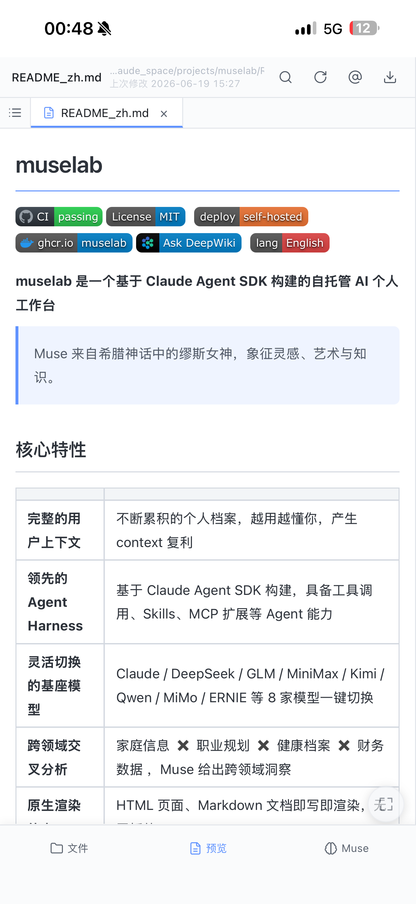
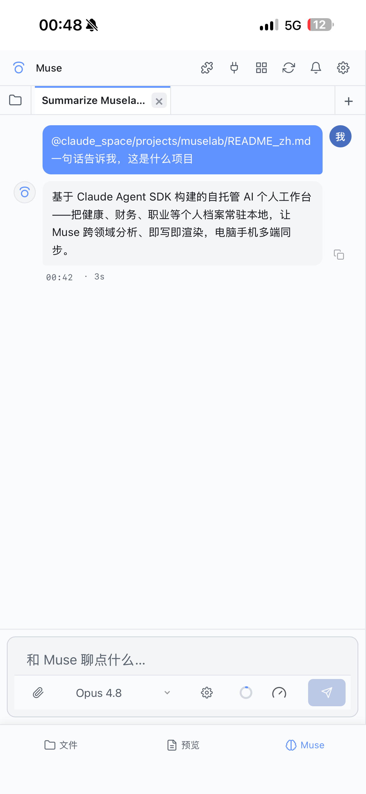

<h1 align="center">muselab-codex</h1>

<p align="center">
  <a href="https://github.com/hesorchen/muselab-codex/actions/workflows/ci.yml"></a>
  <a href="LICENSE"></a>
  <a href="docs/quickstart.md"></a>
  <a href="README.md"></a>
</p>

<p align="center"><strong>A self-hosted AI workspace built on <code>codex app-server</code></strong></p>

<p align="center"><em>Give Codex a durable local workspace and a browser designed for long-running work.</em></p>

<table align="center">
<tr>
<td align="center"></td>
<td align="center"></td>
<td align="center"></td>
<td align="center"></td>
</tr>
<tr>
<td align="center">Mobile · files</td>
<td align="center">Mobile · preview</td>
<td align="center">Mobile · chat</td>
<td align="center">Desktop · three-pane workspace</td>
</tr>
</table>

<p align="center"><sub>Click an image for the original. muselab-codex keeps the same three-pane workspace experience as muselab.</sub></p>

muselab-codex turns a locally authenticated Codex installation into a persistent file and conversation workspace. Your material stays local, Codex works directly with the real workspace, and the browser provides file management, previews, multi-thread chat, streaming, and mobile access.

```text
Browser → FastAPI HTTP/SSE → codex app-server Unix WebSocket → Codex
```

There is one agent runtime. muselab-codex does not maintain a second model loop or reduce Codex to a generic chat endpoint.

muselab-codex supervises a local Unix-socket listener. To enter the same live thread
state from a terminal, copy the `codex resume --remote unix:///.../app-server.sock`
command shown under Settings → About. A plain `codex` command still starts an
independent runtime.

## Core features

| Capability | What it provides |
|---|---|
| **Codex-native agent harness** | `codex app-server` owns threads, turns, tools, approvals, sandboxing, Skills, MCP, and account limits |
| **Durable local context** | `MUSELAB_ROOT`, `AGENTS.md`, Memory, and workspace files form an inspectable context system |
| **File workspace** | Tree, full-text search, upload, edit, trash, and previews for Markdown, code, images, PDF, CSV, XLSX, and HTML |
| **Multi-thread workflows** | Streaming, replay, message queues, fork, compact, sub-agent threads, and concurrent browser tabs |
| **Native extensions** | Skills, MCP servers, OAuth state, approvals, and structured user questions are surfaced directly from Codex |
| **Scheduler and terminal** | Run saved prompts on a schedule and supervise background terminal processes |
| **Self-hosted and mobile** | Localhost defaults, systemd, launchd, Docker, PWA, HTTPS reverse proxy, and Web Push |
| **Native Responses providers** | Verified MiniMax M2.7, Qwen 3.7 Plus, and MiMo V2.5 Pro through Codex `model_providers` |

## Quick start

### One-line install

Linux, macOS, and WSL2 with systemd enabled:

```bash
curl -fsSL https://raw.githubusercontent.com/hesorchen/muselab-codex/main/scripts/quick-install.sh | bash
```

The installer clones the repository, checks `uv`, Node.js, and Codex CLI, validates `codex login`, creates a private `.env`, and registers a user service.

### Manual install

```bash
git clone https://github.com/hesorchen/muselab-codex
cd muselab-codex
codex login
bash scripts/install-linux.sh        # use install-macos.sh on macOS
```

### Verify the installation

1. Open `http://127.0.0.1:8765` in a browser.
2. Enter the generated `MUSELAB_TOKEN`.
3. Create a thread and send “Hello”.
4. Ask Codex to read or create a workspace file.

If something fails, run `bash scripts/doctor.sh` or follow [Troubleshooting](docs/troubleshooting.md). `runtime.ready: true` in the health response means both FastAPI and Codex app-server are ready.

> **Windows:** install through WSL2 with systemd enabled; see [Quick start](docs/quickstart.md#wsl2).

## Conversation workflow

> “Scan this directory, explain how the Markdown, PDF, and spreadsheet files relate, then write a new Markdown overview.”

Muse reads the real files, uses terminal tools, requests approval when needed, and writes results back in the same Codex thread. You can continue with a standalone HTML report and inspect it in the preview pane. When a long conversation approaches its context limit, use native compact to reduce the current thread context and keep working.

There is no separate chunking or application-owned RAG index. Every workspace change remains visible, editable, and backup-friendly.

## Why Codex-native?

| Approach | Common limitation | muselab-codex choice |
|---|---|---|
| Generic web chat | Temporary uploads and application-reimplemented tools | Use the local workspace and Codex tool loop directly |
| Standalone terminal session | Great for a shell, but no preview pane, mobile UI, or browser tabs | Let the browser and CLI join the same app-server runtime |
| Application-owned agent layer | Threads, approvals, Skills, and MCP can diverge from upstream semantics | Keep Codex authoritative; adapt only the UI and transport |

## Practical details

- **Three-pane workspace** — Coordinate the file tree, preview pane, and chat; preview Markdown, code, images, PDF, CSV, XLSX, and HTML.
- **Multi-thread tabs** — Open a new thread immediately, then replay, rename, fork, compact, or queue messages.
- **Bilingual and themeable** — Switch languages without a reload; use light, dark, or eye-care themes and the mobile PWA.
- **One native runtime** — Copy the remote command from Settings → About to enter the same live thread state from Codex CLI.
- **Observable agent state** — See health, account usage, context usage, tool progress, approvals, and MCP questions in the browser.

## Codex-native architecture

| muselab-codex owns | Codex app-server owns |
|---|---|
| Browser UI, PWA, and token authentication | Threads, turns, and transcripts |
| HTTP/SSE adaptation and process supervision | Model calls, streaming events, and the tool loop |
| Safe workspace file APIs | Sandbox, approvals, and user questions |
| Attachment storage and numeric usage sidecars | Skills, MCP, Memory, and configuration precedence |
| systemd, launchd, and Docker integration | Login state, account limits, and native history |

This boundary is a maintenance rule: when Codex already defines authoritative semantics, muselab-codex adapts them instead of recreating them.

## Native model providers

| Provider | Model | Environment variable | Web Search |
|---|---|---|---|
| MiniMax | `minimax-m2.7` | `MINIMAX_API_KEY` | disabled for compatibility |
| Qwen | `qwen3.7-plus` | `DASHSCOPE_API_KEY` | disabled for compatibility |
| Xiaomi MiMo | `mimo-v2.5-pro` | `XIAOMI_MIMO_API_KEY` | disabled for compatibility |

Put credentials in the private environment inherited by the service, restart it, then enable the provider under **Settings → Models**. The browser never reads, displays, or submits the keys. See [Configuration](docs/configuration.md).

## Development

Requires Python 3.12+, [uv](https://docs.astral.sh/uv/), Node.js, and an authenticated Codex CLI. The current tested protocol baseline is `codex-cli 0.144.1`.

```bash
git clone https://github.com/hesorchen/muselab-codex
cd muselab-codex
uv sync
cp .env.example .env
# Set at least MUSELAB_TOKEN and MUSELAB_ROOT in .env
uv run python -m backend.main
```

Quality gates:

```bash
uv run pytest tests/
uv run ruff check backend/ tests/
bash scripts/lint.sh
node --check frontend/app.js
```

## Documentation

**[📚 English documentation index](docs/README.md)** · **[中文文档](docs/README_zh.md)**

- **Start:** [Quick start](docs/quickstart.md) · [Linux](docs/install-linux.md) · [macOS](docs/install-macos.md) · [Upgrade](docs/upgrade.md)
- **Configure:** [Environment and providers](docs/configuration.md) · [Skills](docs/skills.md) · [Scheduler](docs/scheduler.md) · [Mobile](docs/mobile.md)
- **Understand:** [Architecture](docs/architecture.md) · [Infrastructure](docs/infrastructure.md) · [Native specs](docs/specs/)
- **Operate:** [Troubleshooting](docs/troubleshooting.md) · [Data and backup](docs/data-and-backup.md) · [Security](SECURITY.md)
- **Project:** [Contributing](CONTRIBUTING.md) · [Third-party licenses](THIRD_PARTY_LICENSES.md)

## Security note

Anyone holding `MUSELAB_TOKEN` can operate on files under `MUSELAB_ROOT` and drive approved Codex tools. Keep `MUSELAB_HOST=127.0.0.1` by default. For remote access, add HTTPS and another access-control layer. Never commit `.env`, `CODEX_HOME`, or a real workspace.

## Project status

The current version is `0.1.0a1`. The core Codex-native path is operational, while the protocol compatibility baseline will continue to track Codex CLI releases.

This repository evolves independently from muselab and retains its MIT license; it is not a GitHub fork.

[MIT](LICENSE)
